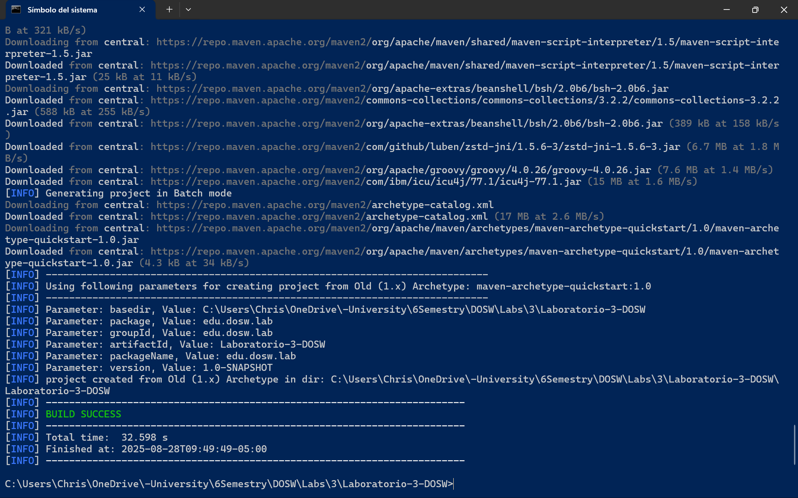
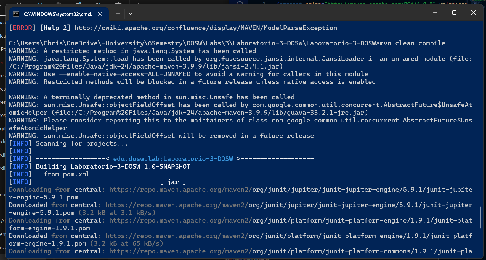
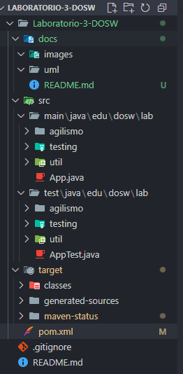

<h1 align="center">Laboratorio 3 - DOSW</h1>

## Integrantes

- Carlos Mario Piedrahita Arango
- Juana Lozano Chaves
- Christian Alfonso Romero Martinez

<h2 align="left" style="color:#2e86de; font-size:2em;">Parte 1: Compilación de Maven</h2>

---

	
	
	
	

**Evidencias trabjo integrante 2**

	
	
	

**Reto 1**
**Reglas de Negocio**
1.	Los números de cuenta deben tener exactamente 10 dígitos.
2.	Una cuenta es válida únicamente si los dos primeros dígitos corresponden a un banco registrado en el sistema (ejemplo: 01 → Bancolombia, 02 → Davivienda, etc.).
3.	Los números de cuenta no pueden contener letras ni caracteres especiales, solo números.
4.	Cada cuenta debe estar asociada a un único cliente registrado en el sistema.
5.	Una cuenta no puede ser creada si ya existe otra con el mismo número.
6.	Solo se pueden realizar operaciones (consulta, depósito) sobre cuentas válidas y registradas.
7.	La consulta de saldo únicamente está permitida si la cuenta existe en el sistema.

